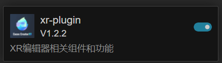
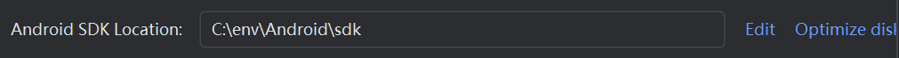
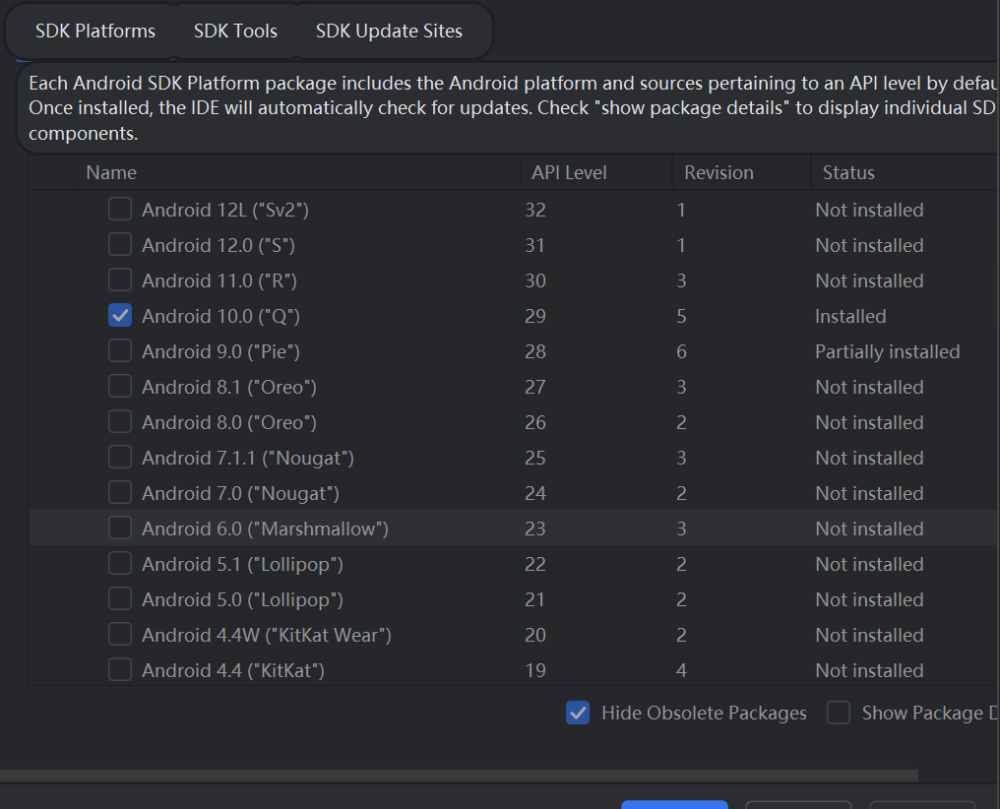
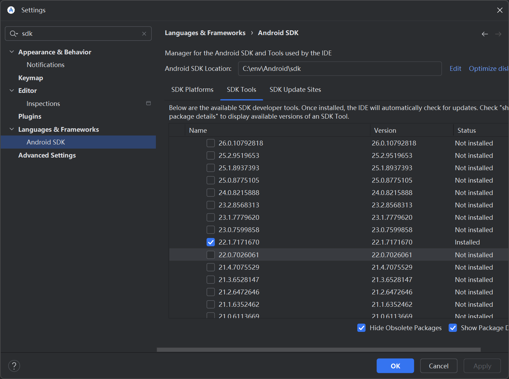
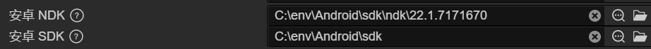
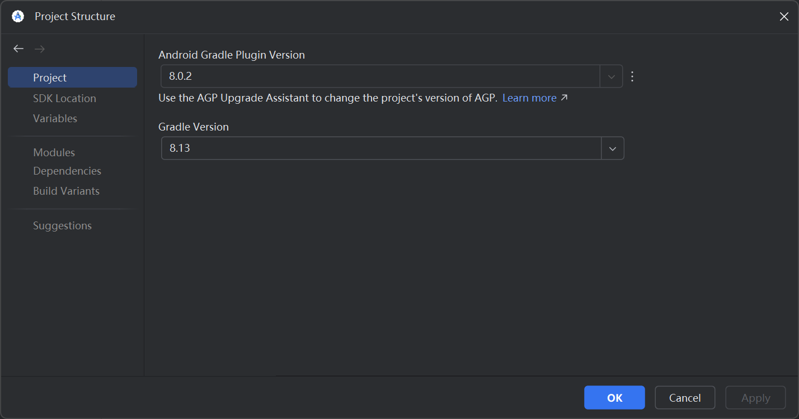

# 开发环境
### Cocos Creaotr 3.8.4

### xr-plugin插件

# 构建与打包环境
### 先下载Android Studio(打apk包用),版本Meerkat|2024.3.1
### 下载完file->settings->language&framework->android sdk
### 记住这个位置

### sdk platform下这个

### sdk tools下这些
### build-tools应该不用下这么多

### ndk下载22.1

### 剩下的

### 下载完之后回到Cocos Creator 文件->偏好设置->程序管理器

### 打包时file->project structure->project

### 上面的AGP版本应该是默认的，下边的gradle版本选8.13
### file->settings->build->build tools->gradle
